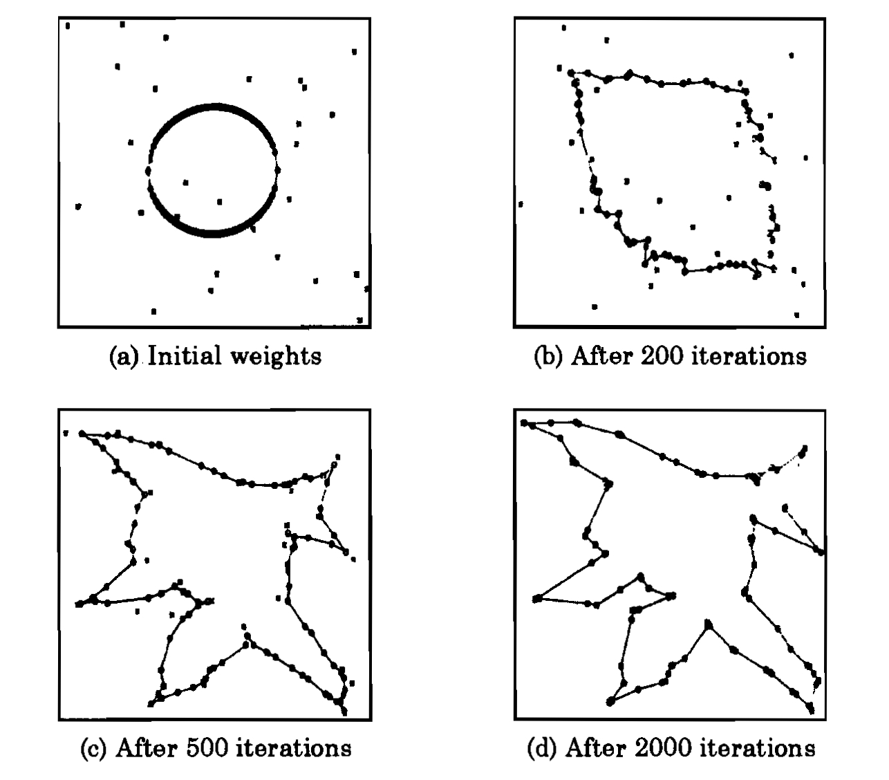

- Observe the behaviour of the SOM network as a function of number of iterations. As the number of iterations increases, the weights of the SOM network align closer to the coordinates of the cities. Let us consider a SOM network with K-unit output layer and a 2-unit input layer. In this case, K=100 and N=30 (i.e., 30 cities and 100 neurons in the output layer). The 2-dimensional input represents the coordinate values of a city. The units in the output layer are arranged along a closed curve. The  weights vectors corresponding to adjacent units are joined to form a closed curve. In the following figure, plot (a) shows the coordinates of the cities (marked by symbol 'x')  and the weight vectors (marked by symbol 'o'). The initialization of weight vectors along the rim of a ring is known as elastic ring approach in feature mapping. Plots (b), (c) and (d) show the closed path after 200, 500 and 1000 iterations, respectively. Note that some of the cities may not be visited.

- Observe the output of the network for different number of cities. Start from a small number of cities (such as 10), and go up to a large number of cities (such as 100 or more). Note that the solution provided by SOM is suboptimal, in the sense that coordinates of some cities may not be covered by the weights of the network. Observe this behaviour for varying number of cities.
- The variation of neighbourhood function for different iterations needs to be scheduled. A larger neighbourhood function is used initially, and the size of the neighbourhood is reduced progressively. The effect of this change can be observed.

